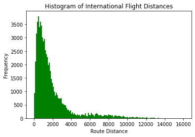

# **Lab5: Analyzing Airport Data**

Author: Claire Morehouse

Date: November 21st, 2020

### What you will submit:

Description: This lab takes data regarding the locations of international airports and flight routes and creates an output of a histogram
that visualizes the frequency of distances for international flights. The inputs of this lab are Airport.dat, Routes.dat, camp_stats.csv. The outputs are Airports for a specific country, a dictionary of Airport IDS and latitude, a dictionary of Airport IDS and longitude, a list of route
distances, a histogram that visualizes those distances. 

The final output is below:

## Data 
Data is found at [OpenFlights project](https://openflights.org/). Visit the [OpenFlights data page](https://openflights.org/data.html) and download their airports data file - “airports.dat”. This is a file in CSV format, open it in a text editor if you want to have a look at it. If, for some reason, you can't access the OpenFlights page or download the data, there is an [archived data set in the data folder of this tutorial](data/airports.dat).

